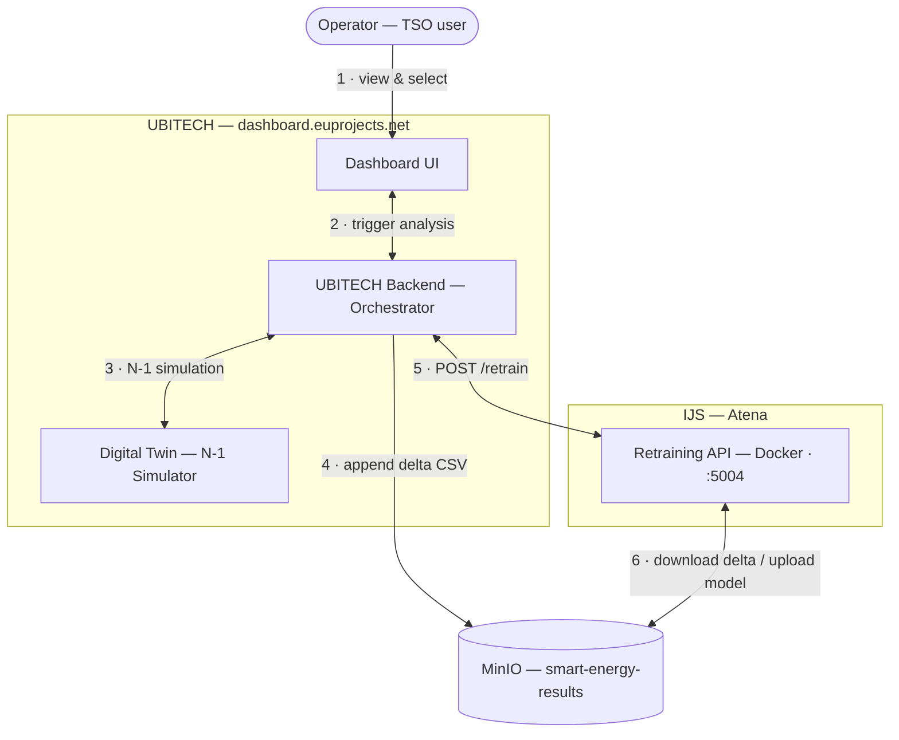

# System Architecture — Smart Energy Active Learning

> **Status:** Iteration 1 deployed. Iteration 2 (batch ranking via `/rank`) is proposed —
> see `docs/iteration-2-proposal.md`.

Six components in two layers. Steps 1–6 describe the current operator-driven
retraining workflow.

## Component summary

### Operator

| Property | Value |
|---|---|
| Role | Selects uncertain samples (p_insecure ≈ 0.5) to trigger Digital Twin simulation |
| Interface | `humaine-dashboard.euprojects.net` |
| Iteration 1 | Selects one sample at a time — no AL strategy ranking yet |
| Iteration 2 | Will review ranked list of 24 day-ahead candidates and pick a subset |

### Dashboard UI

| Property | Value |
|---|---|
| Owner | UBITECH — Kostas Mylonas, Magda Foti |
| URL | `humaine-dashboard.euprojects.net` |
| Displays | p_insecure per hour: green bars 00:00–23:00 |
| Iteration 2 | Needs to show ranked candidate list from `/rank` endpoint |

### UBITECH Backend

| Property | Value |
|---|---|
| Owner | UBITECH — Kostas Mylonas |
| Role | Orchestrates: DT simulation → MinIO append → API retrain |
| Calls our API | `http://atena.ijs.si:5004/retrain` |
| Open question | Does dashboard send `latest_key`? (pending Kostas confirmation) |

### Digital Twin

| Property | Value |
|---|---|
| Owner | UBITECH |
| Input | `load_*`, `gen_*`, `sgen_*` features + timestamp |
| Output | label: secure / insecure + physical metrics |
| Insecure if | Line >100%, voltage outside [0.90–1.10] pu, or non-convergence |
| Iteration 2 | Should also return: `contingency_id`, `overloaded_line_id` |

### MinIO

| Property | Value |
|---|---|
| Bucket | `smart-energy-results` |
| Delta CSV | `al_training_dataset/appended_rows/...appended_rows_latest.csv` |
| Full CSV | `al_training_dataset/simulation_security_labels_n-1.csv` (21.4 MB — NOT fetched per retrain) |
| Model out | `models/retraining_runs/<timestamp>/model.joblib` |
| Metrics out | `models/retraining_runs/<timestamp>/metrics.json` |

### Retraining API

| Property | Value |
|---|---|
| Owner | IJS |
| URL | `http://atena.ijs.si:5004` |
| Docker image | `leskovecg/smart-energy-api:1.3.0` |
| Ports | Host 5004 → Container 8000 |
| Volume | `./data:/app/data` (base + appended CSV accessible in container) |
| Base CSV | `/home/gleskovec/retraining-api/data/base/simulation_security_labels_n-1.csv` |
| Auth | X-API-Key header required for POST `/retrain` |
| Endpoints now | `GET /health` \| `POST /retrain` |
| Start script | `start-app.sh` (Atena only — not in git repo) |
| Pending | al_strategy logic, `/rank` endpoint, XAI |

## Key MinIO paths

| Artifact | Key |
|---|---|
| Delta CSV | `al_training_dataset/appended_rows/simulation_security_labels_n-1_appended_rows_latest.csv` |
| Full base CSV | `al_training_dataset/simulation_security_labels_n-1.csv` (21.4 MB — not fetched per retrain) |
| Trained model | `models/retraining_runs/<timestamp>/model.joblib` |
| Metrics | `models/retraining_runs/<timestamp>/metrics.json` |

> Full API spec: `docs/retraining-api-current-state.md`
