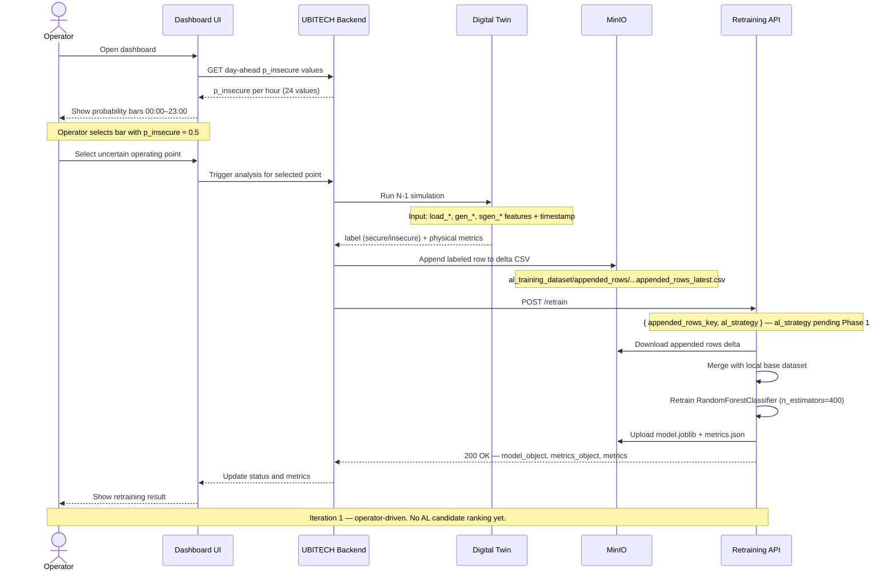

# Sequence Diagram — Iteration 1 Workflow (Deployed)

> **Status:** Deployed and running on Atena.
> AL strategies are **not yet used** for sample ranking. The operator selects samples manually.

## Notes

- Ground-truth labels always come from the Digital Twin / N-1 simulation — the operator
  does not manually assign labels.
- The base dataset (21.4 MB) lives locally on Atena and is never re-downloaded from MinIO.
- **Phase 1 (pending):** `al_strategy` added to `/retrain` payload as metadata only.
- **Iteration 2 (proposed):** new `/rank` endpoint for batch ranking of 24 day-ahead
  candidates. See `docs/iteration-2-proposal.md`.
