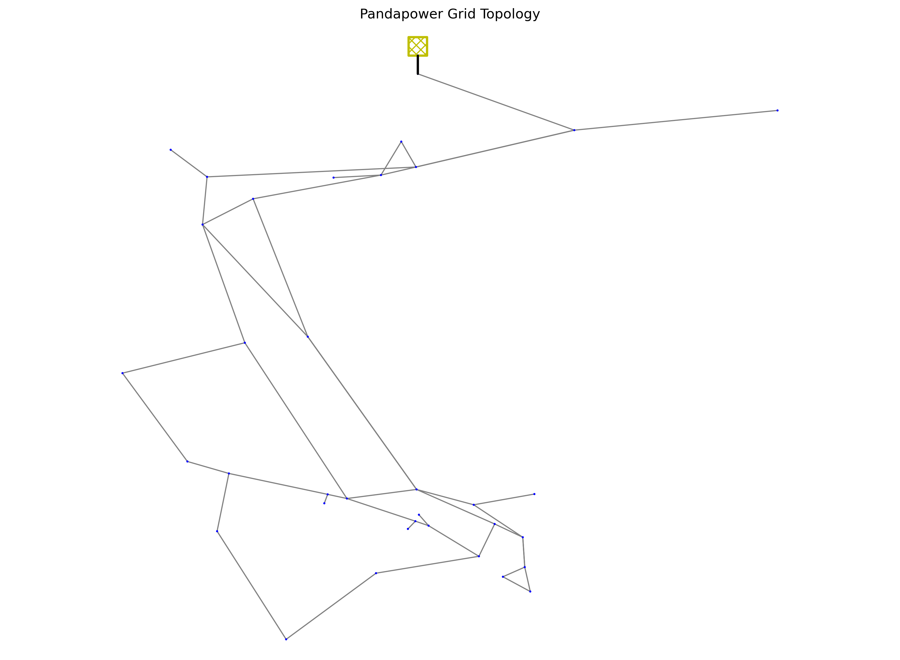

# ⚡ Data Description – Smart Energy N-1 Security Assessment

## 🎯 1. Purpose of the dataset

This project uses a **digital-twin-based simulation pipeline** to create a dataset for **electric power grid security assessment under the N-1 criterion**.

The goal is to train a machine learning classifier that predicts whether a given grid operating point is:

- ✅ `secure`
- ⚠️ `insecure`

Instead of running expensive N-1 simulations for every new case, the trained model provides a fast approximation of the grid security state. Active Learning can then be used to decide which new cases are most informative and should be simulated next.

---

## 🧭 2. High-level data generation flow

The dataset is created through the following pipeline:

```text
digital_twin_ext_grid.json
+ distributed_loads_uniform.csv
+ distributed_generators.csv
        ↓
prepare_dataset.ipynb
        ↓
N-1 contingency simulations with pandapower
        ↓
simulation_security_labels_n-1.csv
        ↓
train_classifier.ipynb
        ↓
random_forest_model.pkl
```

In simple terms:

```text
grid topology + load/generation time series
→ operating points
→ power-flow simulations
→ N-1 contingency analysis
→ secure/insecure labels
→ ML training dataset
```

---

## 🧠 3. What is the digital twin?

The file:

```text
digital_twin_ext_grid.json
```

contains a **pandapower digital twin** of the transmission grid, i.e., an electric power system model used for power-flow and N-1 security simulations.

A digital twin is a computational representation of a physical power grid. It contains the structure and technical parameters needed to run simulations.

In this project, the digital twin includes:

- 🚌 buses
- 🔌 transmission lines
- 🏭 generators
- 🌱 static generators / distributed generation
- 🏠 loads
- ⚖️ external grid / slack bus
- 📏 voltage limits
- 🚦 line loading limits
- 🕸️ grid topology

The grid model is **not a generic toy network**. It is a simulation-ready digital twin derived from the topology of the Greek transmission network.

However, it should be understood as a **modelling/simulation representation**, not necessarily as a full real-time operational copy of the real grid.

### Grid topology

The following figure shows the topology of the electric power grid used by the digital twin:



---

## 📈 4. What are the input time series?

The simulation pipeline uses two main time-series input files. Both files represent one year of operating-condition data used to create hourly grid operating points.

### 🏠 `distributed_loads_uniform.csv`

This file contains one year of load time-series values, distributed across the load nodes of the network.

It represents the demand side of the operating point:

```text
how much power is consumed at different load buses at a given timestamp
```

The word `uniform` suggests that at least part of the load distribution may be generated or allocated using a uniform distribution rule. Therefore, unless confirmed by the data provider, this file should not be described as purely real measured load data.

### 🏭 `distributed_generators.csv`

This file contains one year of generator time-series values.

It represents the generation side of the operating point:

```text
how much power is produced by different generators at a given timestamp
```

Together, the load and generator time series define the changing operating conditions of the grid over time.

---

## 📍 5. What is an operating point?

An **operating point** is a snapshot of the grid at one timestamp.

For one specific hour, an operating point contains:

```text
timestamp
load values at load buses
generator outputs
distributed generator outputs
network topology
active grid elements
```

In simple terms:

```text
operating point = the state of the whole grid at a specific moment in time
```

The classifier does **not** classify one isolated line or one isolated generator. It classifies the security of the **whole grid state** represented by that operating point.

---

## 🏗️ 6. How is the dataset generated?

The notebook:

```text
prepare_dataset.ipynb
```

creates the training dataset.

The process is approximately:

1. 📥 Load the digital twin from `digital_twin_ext_grid.json`.
2. 📥 Load the annual load time series from `distributed_loads_uniform.csv`.
3. 📥 Load the annual generator time series from `distributed_generators.csv`.
4. 🕒 For each timestamp, update the digital twin with the corresponding load and generation values.
5. ⚡ Run a base-case AC power-flow simulation.
6. 🔁 Apply N-1 contingencies by removing one grid element at a time, for example a line or generator.
7. ⚡ Re-run the power-flow simulation after each contingency.
8. 🚦 Check whether voltage or line-loading limits are violated.
9. 🏷️ Assign a label: `secure` or `insecure`.
10. 💾 Save the final dataset into `simulation_security_labels_n-1.csv`.

---

## 🔁 7. What does N-1 mean?

The **N-1 criterion** means that the power grid should remain secure even if one single component fails.

A component can be, for example:

- 🔌 one transmission line
- 🏭 one generator
- ⚙️ one transformer, depending on the simulation setup

The core question is:

```text
Can the grid still operate safely if one element is removed?
```

If the grid remains within operational limits after each tested single-element outage, the operating point is considered secure.

If at least one contingency causes a violation or non-convergence, the operating point is considered insecure.

---

## 🏷️ 8. What is the label?

The label is stored in the final dataset as:

```text
status
```

Possible values:

```text
secure
insecure
```

The label is **not manually assigned by a human operator**. It is generated by the simulation pipeline.

A sample is labeled `secure` if the base-case and the tested N-1 contingency simulations satisfy the operational limits.

A sample is labeled `insecure` if at least one of the following happens:

- 🚨 line loading exceeds the allowed threshold
- 🚨 bus voltage goes outside the allowed range
- 🚨 the power-flow simulation does not converge
- 🚨 another configured security constraint is violated

The exact thresholds should be checked in the current version of `prepare_dataset.ipynb` and the digital twin configuration. In general, the security assessment is based on voltage limits, line-loading limits, and power-flow convergence.

---

## 📊 9. What is inside `simulation_security_labels_n-1.csv`?

The file:

```text
simulation_security_labels_n-1.csv
```

is the final supervised machine learning dataset.

It contains:

- 🕒 timestamp information
- 🏠 load features, usually named like `load_*`
- 🏭 generator features, usually named like `gen_*`
- 🌱 static generator / distributed generation features, usually named like `sgen_*`
- ⚡ simulation-derived security indicators
- 🏷️ final label column: `status`

This file is the output of `prepare_dataset.ipynb` and the input to `train_classifier.ipynb`.

---

## 🤖 10. How is the classifier trained?

The notebook:

```text
train_classifier.ipynb
```

takes the labeled dataset:

```text
simulation_security_labels_n-1.csv
```

and trains a machine learning classifier.

The trained model is saved as:

```text
random_forest_model.pkl
```

This model can then be used to predict the probability that a new operating point is insecure.

The dashboard value:

```text
p_insecure
```

is most likely the model output probability for the `insecure` class.

For example:

```text
p_insecure = 0.06
```

means:

```text
the model estimates a 6% probability that this operating point is insecure
```

This probability is a **model prediction**, not a raw measurement from the grid.

---

## 🧪 11. Are the data real or synthetic?

The most accurate description is:

```text
digital-twin-based, simulation-generated, semi-synthetic dataset
```

More precisely:

| Part of the data | Description |
|---|---|
| 🕸️ Grid topology | Realistic / derived from the Greek transmission network |
| 🧠 Digital twin | Simulation model in pandapower |
| 🏠 Load time series | Provided annual load profiles; exact original source not documented here |
| 🏭 Generator time series | Provided annual generation profiles; exact original source not documented here |
| 🏷️ Secure/insecure labels | Generated by N-1 simulations |
| 🤖 `p_insecure` values | Predicted probabilities from the trained ML model |

Therefore, the dataset should **not** be described as purely real measured operational data.

It should also **not** be described as a fully artificial toy dataset.

A good explanation is:

```text
The dataset is based on a realistic digital twin of the Greek transmission grid. 
The labels are generated using pandapower N-1 simulations. 
The load and generation profiles are provided as time-series inputs, but their original source is not explicitly documented in the initial material. 
Therefore, the dataset is best described as semi-synthetic or simulation-generated.
```

---

## 🌍 12. Is the data from ENTSO-E?

There is no direct evidence in the provided project files or initial email that the input data comes from ENTSO-E.

ENTSO-E could theoretically be an upstream source for load or generation profiles, but this is **not confirmed**.

The safe statement is:

```text
The current project material does not explicitly state that the time-series inputs come from ENTSO-E. 
The confirmed sources are the provided CSV time-series files and the pandapower digital twin.
```

---

## 📉 13. How are the dashboard graphs related to the dataset?

The dashboard can show two related but different types of information.

### 🏠 Day-ahead total load forecast

This graph shows the expected total load for each hour.

It answers:

```text
How much demand is expected in the grid at each hour?
```

### ⚠️ N-1 day-ahead security classification

This graph shows the predicted probability of insecurity for each hourly operating point.

It answers:

```text
Given the expected grid state, how likely is the grid to be insecure under the N-1 criterion?
```

The relationship is:

```text
load/generation forecast
→ operating point
→ classifier prediction
→ p_insecure
```

The `p_insecure` value shown on the dashboard is not necessarily stored in the training CSV. It is usually a prediction output produced when the trained model is applied to new operating points.

---

## 🎯 14. Why is Active Learning useful here?

Running N-1 simulations for every possible operating point and contingency is computationally expensive.

Active Learning helps by selecting only the most informative samples for simulation.

Instead of simulating everything, the workflow becomes:

```text
train current model
→ score candidate operating points
→ select uncertain/informative samples
→ run N-1 simulation only for selected samples
→ append new labels
→ retrain model
```

Typical Active Learning strategies include:

- 🧮 entropy sampling
- ❓ uncertainty sampling
- 📏 margin sampling
- 🎲 random sampling as baseline

The key idea is:

```text
use the simulator only where it gives the most learning value
```

---

## 🗣️ 15. Short explanation if someone asks

If someone asks where the data comes from, the short answer is:

```text
The dataset is generated from a pandapower digital twin of the Greek transmission grid. 
We use provided load and generation time series to create hourly operating points. 
For each operating point, the pipeline runs base-case and N-1 contingency simulations. 
The secure/insecure label is generated from simulation results, based on voltage limits, line loading limits, and convergence. 
So the dataset is not purely real measured data; it is best described as a realistic digital-twin-based simulation dataset.
```

If someone asks whether the dataset is synthetic or real, the short answer is:

```text
It is semi-synthetic. 
The topology is realistic and derived from the Greek transmission network, but the labels are simulation-generated. 
The original source of the load and generation time series is not explicitly documented in the provided material, so we should not claim that they are directly from ENTSO-E unless this is confirmed by the data provider.
```

---

## ✅ 16. One-sentence summary

```text
This dataset is a semi-synthetic, digital-twin-based power-grid security dataset generated by running N-1 simulations on a pandapower model of the Greek transmission network using provided load and generation time series.
```
