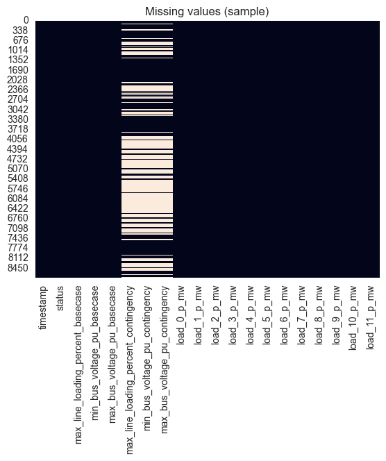

# Report: Dataset Overview: Power Grid Security Classification

**Author:** Gašper Leskovec  
**Date:** May 14, 2025 

## 1. Source of Dataset

The dataset `simulation_security_labels_n-1.csv` was generated using the script `prepare_dataset.py`. It combines two time-series datasets:

- `distributed_generators.csv`: power output of generators and sgens,
- `distributed_loads_uniform.csv`: power demand of distributed loads.

The script performs the following steps:

1. **Load grid model** from `digital_twin_ext_grid.json` using `pandapower`.
2. **Synchronize timestamps** between generator and load data.
3. For each timestamp:
   - Run **base case power flow**.
   - If secure, run **N-1 contingency analysis** (disable lines and generators one by one).
   - Check for voltage or line loading violations.
   - Assign label `secure` or `insecure`.
4. Save voltage/load metrics and per-unit powers to `simulation_security_labels_n-1.csv`.

This dataset forms the basis for the binary classification task (secure vs insecure).

---

## 2. Dataset Size and Structure

- **Number of rows (samples)**: `8769`
- **Number of columns (features)**: `273`

The dataset includes:

- A **timestamp** column (hourly data for one year),
- A **status** label (`secure` or `insecure`),
- Voltage and line loading statistics (base case and contingency),
- Power values for each **load**, **generator**, and **sgen** (e.g. `load_0_p_mw`, `gen_1_p_mw`, ..., `sgen_109_p_mw`).

These features were extracted from time-series power grid simulations and form the basis for the binary classification task.

---

## 3. Target Variable

- **`status_binary`**: a binary label indicating the security of the system state.
  - `1` → secure state
  - `0` → insecure state
- This variable was derived from the original categorical column `status`.

---

## 4. Features Description

| Feature                                | Description |
|----------------------------------------|-------------|
| `timestamp`                            | Time of simulation sample (hourly granularity). |
| `status`                               | Binary label of the grid's security: `secure` or `insecure`. |
| `max_line_loading_percent_basecase`    | Maximum percentage of line load in the **base case** scenario. Values > 100% indicate overload risk. |
| `min_bus_voltage_pu_basecase`          | Minimum bus voltage in per unit (pu) during base case. |
| `max_bus_voltage_pu_basecase`          | Maximum bus voltage (pu) during base case. |
| `max_line_loading_percent_contingency` | Max line load during worst-case **N-1 contingency** (e.g. a line or generator failure). |
| `min_bus_voltage_pu_contingency`       | Minimum voltage under contingency. |
| `max_bus_voltage_pu_contingency`       | Maximum voltage under contingency. |
| `load_{i}_p_mw`                         | Active power (MW) of load with index `i` at this timestamp. |
| `gen_{i}_p_mw`                          | Active power (MW) of generator with index `i`. |
| `sgen_{i}_p_mw`                         | Active power (MW) of static generator (e.g. solar) with index `i`. |

There are:
- **20+ loads**, 
- **135+ generators**, and 
- **110 static generators (sgen)**

…each contributing one feature (column) representing their power at every timestamp.

These features allow the model to capture the full operating state of the grid and assess its security under normal and N-1 failure scenarios.

---

## 5. Temporal Nature of Data

Although the dataset includes a `timestamp` column ranging from `2023-01-01 00:00:00` to `2023-12-31 23:00:00`, this field mainly serves as a unique identifier for each simulation instance. 

Each row corresponds to an **independent power system simulation** with specific load and generation conditions. Therefore:

- The dataset is **not a time series** in the traditional sense.
- The **order of rows does not reflect real temporal causality**.
- There is **no temporal dependency** between the rows — each scenario is simulated in isolation, regardless of its timestamp.

---

## 6. Simulation Duration

- Each row represents the result of a single N-1 contingency simulation scenario.
- The simulations represent **short-term events** in the power grid, lasting from a few seconds to several minutes.
- The **exact duration of each simulation is not provided** in the dataset.
- The `timestamp` column serves only as an identifier for each simulation and does not represent actual time.
- The data is based on **synthetic simulations**, not real chronological measurements.

---

## 7. Exploratory Data Analysis (EDA)

To better understand the dataset before applying machine learning models, we conducted the following exploratory analyses:

- **Class distribution**:  
    The target variable `status` is fairly balanced:
  
  - `secure`: 4497 samples  
  - `insecure`: 4272 samples  

- **Missing values**:  
   Only 3 features contain missing values:
  - `max_line_loading_percent_contingency`
  - `min_bus_voltage_pu_contingency`
  - `max_bus_voltage_pu_contingency`

    These are `NaN` when the base-case simulation is already insecure (so N-1 simulation is skipped).  

****

- **Unique values per column**:  
  The number of unique values per feature varies, from just 1 (e.g., `min_bus_voltage_pu_basecase`) to over 8700 (e.g., `timestamp`). This shows which features are constant and which vary across simulations.

****

  Example summary:

- **Feature value ranges**:  
  - Line loadings mostly stay below 100%, but in some insecure cases they spike above the threshold.
  - Voltage values are usually within the acceptable range (0.9–1.1 pu), with deviations in insecure scenarios.

- **Correlation analysis**:  
  Strong correlations were observed between load and generation columns, as expected.  
  Some contingency-related metrics (e.g., `min_bus_voltage_pu_contingency`) are correlated with the final `status`.

- **Time distribution**:  
  While a `timestamp` column is present, the data is not time-series; rows are independent simulation results. Temporal trends were therefore **not analyzed**.

- **Outliers**:  
  Extreme values were observed in generator and sgen (static generator) power outputs in some scenarios, which may influence model sensitivity.

- **Feature relevance**:  
  Many individual `load_*`, `gen_*`, and `sgen_*` features contribute to the simulation outcomes. Dimensionality reduction may be explored later.

