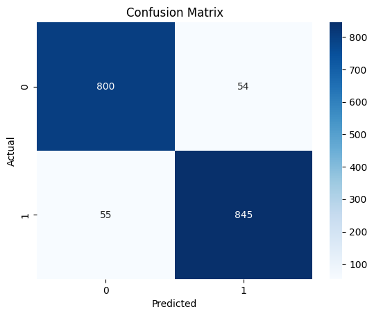
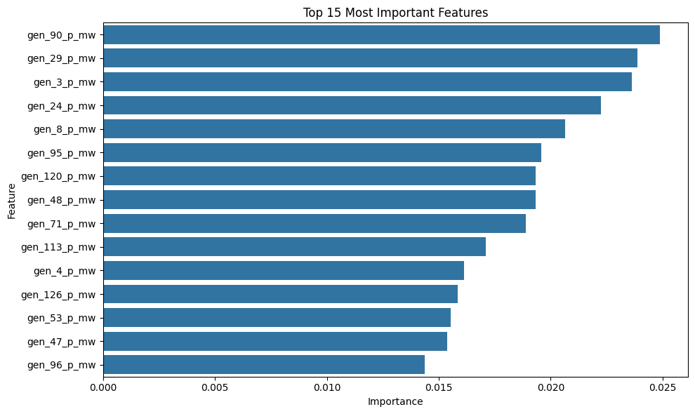

# Report 00 – Intro: Model training for classification

**Author:** Gašper Leskovec  
**Date:** April 3, 2025  

## Objective

This report summarizes the initial work on a security classification model for power system scenarios using Random Forests. The focus was on understanding the dataset and validating an existing trained model that was shared via email. I explored model performance, feature importance and evaluated classification metrics including the confusion matrix.

---

## Data preparation

### 1 Input data

The dataset used was `simulation_security_labels_n-1.csv`, containing:
- **273 columns** (including `timestamp`, `status` and power system measurement values)  
- **8769 rows**, representing hourly simulations over one year 

### 2 Cleaning & Transformation

Steps performed:
- Dropped some columns
- Mapped `status` values to binary format:
  - `secure` → 0
  - `insecure` → 1
- Split data into:
  - `X` → features
  - `y` → target labels
- Performed `train_test_split` (stratified, test_size = 20%)

### 3 Class distribution

- `secure` (0): **3597 samples**  
- `insecure` (1): **3418 samples**

---

## Model training

### 1 Algorithm

- Model: `RandomForestClassifier`  
- Parameters: `n_estimators=100`, `random_state=42`

### 2 Results (on test set)

```
              precision    recall  f1-score   support

           0       0.94      0.94      0.94       854
           1       0.94      0.94      0.94       900

    accuracy                           0.94      1754
   macro avg       0.94      0.94      0.94      1754
weighted avg       0.94      0.94      0.94      1754
```

### 3 Confusion matrix

True Positives: 845  
True Negatives: 800  
False Positives: 54  
False Negatives: 55  



---

## Feature importance analysis

**Top 5 most important features:**

1. `gen_90_p_mw`  
2. `gen_29_p_mw`  
3. `gen_3_p_mw`  
4. `gen_24_p_mw`  
5. `gen_8_p_mw`  

> Visualized with `sns.barplot()` – see figure below.



---