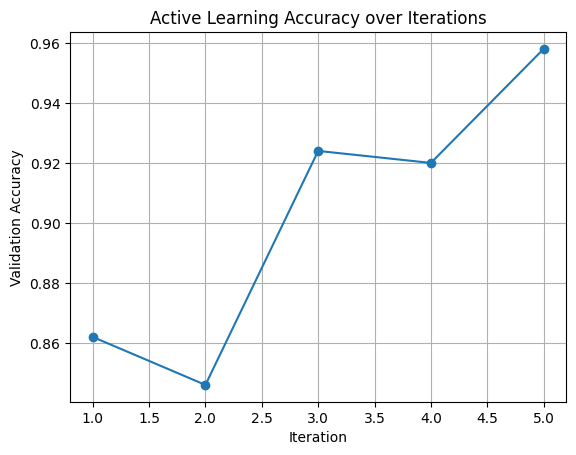
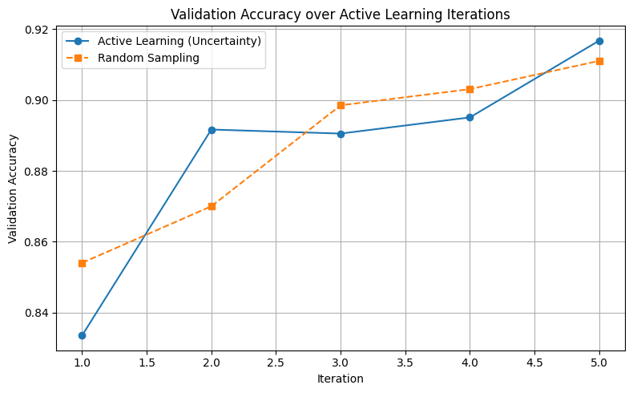

# Report 01 - Active Learning for Smart Energy 

**Author:** Gašper Leskovec  
**Date:** April 8, 2025 

## Purpose of the task
As part of the Smart Energy project, I was assigned to implement *Active Learning* for classifying the security status of a power grid. The dataset is based on N-1 simulations (failure of a single component in the grid) and simulated time series data.

---

## Work completed so far

### Data preparation & analysis
- Loaded the following datasets:
  - `distributed_generators.csv`, `distributed_loads_uniform.csv`, `simulation_security_labels_n-1.csv`
- Performed **EDA** in `eda_classifier_dataset.ipynb`:
  - Identified missing values
  - Created histograms, density plots and unique value counts
- Updated **train_classifier.ipynb**:
  - Trained a Random Forest model
  - Saved the model as `.pkl`
  - Exported evaluation metrics as `.json`

---

### Active Learning setup
- Implemented two main approaches:
  1. `active_learning_uncertainty_fixedsplit.ipynb` → Active Learning with a fixed validation set
  2. `active_learning_uncertainty_vs_random.ipynb` → Comparison between **uncertainty sampling** and **random sampling**
- Used `RandomForestClassifier`, `accuracy_score`, `train_test_split`, `predict_proba`, etc.
- Tracked accuracy improvement across iterations:
  - Active Learning: e.g., 83% → 91%
  - Random Sampling: e.g., 85% → 91%

---

## Results

### Active Learning accuracy


### Comparison with Random Sampling


---

## Key insights
- Active Learning significantly improves accuracy with only a small labeled sample.
- The final accuracy (e.g., 90%+) is promising but **depends on the quality and diversity of the initial sample**.
- The pre-trained `random_forest_model.pkl` can be used as a **baseline for comparison**.

---

## Next steps

1. Validate results with multiple random seeds / initial samples
2. Add more evaluation metrics (precision, recall, f1-score)

---

## Key file structure

```
📦 notebooks/task1_security_classification/active_learning
├── active_learning_uncertainty_fixedsplit.ipynb
├── active_learning_uncertainty_vs_random.ipynb
```

```
📦 models/task1_security_classification
├── random_forest_model.pkl
├── model_metrics_*.json
```

---


